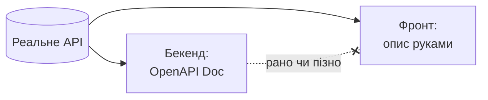
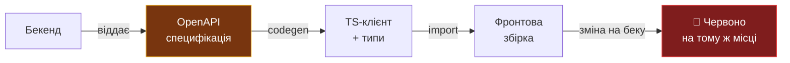

# Не описуй API двічі

Генеруй фронтовий клієнт із OpenAPI-специфікації бекенду

<div class="pt-12">
  <span class="px-2 py-1 rounded opacity-70">
    Одне джерело правди для фронту й бекенду <carbon:arrow-right class="inline"/>
  </span>
</div>

<!--
Історія про те, як перестати писати API-клієнт руками й почати його генерувати.
6 блоків: Agreement → Context → Story → Relation → Description → Call to action.
-->

<style>
h1 {
  background-image: linear-gradient(45deg, #f9d34e 10%, #f0b429 40%, #e8a800 90%);
  background-clip: text;
  -webkit-background-clip: text;
  -webkit-text-fill-color: transparent;
}
</style>

---
layout: center
class: text-center
---

# Agreement — про що домовляємось

<div class="max-w-2xl mx-auto text-left leading-relaxed pt-4">

Будь-яка команда хоче, щоб <span v-mark.underline.yellow="1">фронт і бекенд говорили однією мовою</span>
і не ламались одне об одного при кожній зміні API.

<div v-click="2" class="mt-8 text-2xl italic opacity-90 border-l-4 border-yellow-400 pl-4">
«А бекенд перестав відправляти це поле! Де воно зараз?»
</div>

<div v-click="3" class="mt-8 opacity-70">
Всім не подобаються баги. Особливо ті, що з'являються тихо.
</div>

</div>

<!--
Agreement — це спільна цінність, з якою всі згодні. Ніхто не любить баги через
розсинхрон фронту й бекенду. З цього починаємо.
-->

---

# Context — де живе правда про API

<div class="grid grid-cols-2 gap-8 pt-6">

<div v-click="1">

### 🖥️ Бекенд

Бекенд і так знає все про своє API — є **OpenAPI Doc**.
Машинний опис усіх ендпоінтів, полів і типів.

</div>

<div v-click="2">

### 💻 Фронт

А фронт зазвичай описує це саме API **ще раз — руками, у себе**.

</div>

</div>

<div v-click="3" class="pt-8">



</div>

<div v-click="4" class="text-center pt-2 opacity-80">
Одна й та сама правда живе <span v-mark.circle.red="5">у двох місцях</span> — і рано чи пізно ці два описи розходяться.
</div>

<!--
Context — фактичний стан справ. Дублювання джерела правди — корінь проблеми.
-->

---
layout: two-cols
layoutClass: gap-8
---

# Story — як це ламається

<div class="pr-4 leading-relaxed">

Уяви фронтенд-розробника, який пише клієнт до нового endpoint'а.

Бекендер каже «поле називається `userId`» — фронт так і пише.

<div v-click="1" class="mt-4">

Через тиждень на беку його **перейменували на `customerId`** — і ніхто фронту не сказав.

</div>

<div v-click="2" class="mt-4">

Код компілюється, все «працює»… а в проді список порожній.

</div>

<div v-click="3" class="mt-4 text-yellow-400 font-semibold">
Півдня на пошук через одне слово.
</div>

</div>

::right::

<div v-click="4" class="pt-16">

```ts
// Фронт написав руками:
const users = res.data.map(u => ({
  id: u.userId,     // ← беку вже
                    //   немає такого поля
  name: u.name,
}))

// u.userId === undefined
// .map() відпрацював,
// список тихо порожній.
// Жодної помилки. 🫠
```

</div>

<!--
Story — конкретний випадок болю. Найважливіше: код КОМПІЛЮЄТЬСЯ. Помилки немає,
бо u — це any/динамічний об'єкт. Зламалось мовчки.
-->

---
layout: two-cols
layoutClass: gap-12
---

# Relation — аналогія

<div class="pr-4 leading-relaxed pt-4">

Генерований клієнт — це як **телефонна книга контактів** із телефону замість набору номерів вручну.

<div v-click="1" class="mt-6">

Після реалізації цього підходу ти не набираєш номери на пам'ять —

</div>

<div v-click="2" class="mt-2 text-2xl text-yellow-400 font-semibold">
ти використовуєш телефонну книгу.
</div>

</div>

::right::

<div class="pt-10 grid grid-cols-1 gap-4">

<div v-click="1" class="p-4 rounded-lg border border-red-400/40 bg-red-400/5">
<div class="text-sm opacity-60 mb-1">Вручну</div>
<div>Набираєш номер напам'ять щоразу.<br/>Одна цифра не та — не туди подзвонив.</div>
</div>

<div v-click="2" class="p-4 rounded-lg border border-green-400/40 bg-green-400/5">
<div class="text-sm opacity-60 mb-1">Телефонна книга</div>
<div>Обрав контакт зі списку.<br/>Номер завжди актуальний і правильний.</div>
</div>

</div>

<!--
Relation — прив'язуємо нове до знайомого. Ручний клієнт = набір номерів напам'ять.
Генерований = телефонна книга.
-->

---

# Description — як це працює

<div class="pt-2">



</div>

<div class="grid grid-cols-2 gap-6 pt-4">

<div v-click="1">

Бекенд віддає **OpenAPI-специфікацію** — машинний опис усього свого API.
Інструмент читає цю спеку і сам генерує на фронті готовий клієнт і TypeScript-типи.

</div>

<div v-click="2">

Тепер, якщо на беку щось змінилось — після перегенерації фронтовий білд одразу
<span v-mark.red="3">червоний на тому місці</span>, де стало неправильно.

</div>

</div>

<div v-click="4" class="text-center pt-4 text-yellow-400 font-semibold">
Помилка ловиться на збірці, а не злим користувачем.
</div>

<!--
Description — механіка рішення без коду. Далі — три код-слайди, що це доводять.
-->

---

# Крок 1 — бекенд віддає спеку

Один машинний опис ендпоінта. Джерело правди:

```yaml {all|8-13|11}
# openapi.yaml (згенеровано бекендом автоматично)
paths:
  /customers:
    get:
      operationId: listCustomers
      responses:
        '200':
          content:
            application/json:
              schema:
                type: array
                items:
                  $ref: '#/components/schemas/Customer'

components:
  schemas:
    Customer:
      type: object
      properties:
        customerId: { type: string }   # ← було userId
        name:       { type: string }
      required: [customerId, name]
```

<!--
Крок 1: спека — це не документація для людей, а контракт для машини.
customerId тут — єдине джерело істини про назву поля.
-->

---

# Крок 2 — codegen робить клієнт

Одна команда — і на фронті з'являються типізований клієнт і типи:

```bash
$ npx openapi-typescript openapi.yaml -o src/api/schema.ts
# або: openapi-generator, orval, kubb, hey-api ...
```

<div class="grid grid-cols-2 gap-4 pt-2">

<div>

```ts {all|1-5|7-10}
// src/api/schema.ts — ЗГЕНЕРОВАНО
export interface Customer {
  customerId: string
  name: string
}

export async function listCustomers()
  : Promise<Customer[]> {
  return http.get('/customers')
}
```

</div>

<div v-click="3" class="pt-8 leading-relaxed">

Типи прийшли **з беку**, а не написані руками.

Ніхто не передруковував назви полів. Немає другого місця, де можна помилитись.

</div>

</div>

<!--
Крок 2: генерація. Наголос — типи не написані людиною, вони випливають зі спеки.
-->

---

# Крок 3 — розсинхрон = червона збірка

Бек перейменував поле й перегенерував спеку. Дивись, що стається з фронтом:

````md magic-move {lines: true}
```ts
// Було: спека містила userId
interface User { userId: string; name: string }

const users = (await listUsers())
  .map(u => ({ id: u.userId, name: u.name }))
// ✅ Компілюється, працює.
```

```ts
// Стало: перегенерували — тепер customerId
interface Customer { customerId: string; name: string }

const users = (await listCustomers())
  .map(u => ({ id: u.userId, name: u.name }))
//                    ^^^^^^
// ❌ TS2339: Property 'userId' does not
//    exist on type 'Customer'.
```
````

<div v-click class="pt-4 text-center text-yellow-400 font-semibold">
Білд червоний одразу після регенерації — на тому самому рядку. Не в проді. Не через тиждень.
</div>

<!--
Крок 3 — кульмінація. magic-move показує: та сама зміна, що раніше ламала тихо,
тепер ловиться компілятором миттєво. Розсинхрон став ФІЗИЧНО неможливим.
-->

---
layout: center
class: text-center
---

# Call to action

<div class="max-w-3xl mx-auto text-left leading-relaxed pt-2">

Головна ідея: <span v-mark.underline.yellow="1">не описуй API двічі</span> — генеруй фронтову копію з бекенду.

<div v-click="2" class="mt-5">

Не роби роботу, яку за тебе зробить машина. Особливо коли це щей детермінована задача.

</div>

<div v-click="3" class="mt-5">

Один опис, одне джерело правди — і розсинхрон стає <span v-mark.circle.red="4">неможливим фізично</span>,
а не «якщо всі уважні».

</div>

<div v-click="5" class="mt-8 text-xl text-yellow-400">
Наступного разу, коли фронт пише клієнт руками — спитай себе:<br/>
чи не можна це просто згенерувати і чи не витрачаєш ти свій час даремно?
</div>

</div>

<!--
Call to action — конкретна поведінкова зміна. Не "подумайте про це", а "спитай себе"
щоразу перед написанням клієнта руками.
-->

---
layout: center
class: text-center
---

# Одним слайдом

<div class="grid grid-cols-1 gap-3 max-w-2xl mx-auto text-left pt-4">

<div v-click class="flex items-start gap-3">
  <carbon:checkmark-filled class="text-green-400 mt-1 shrink-0"/>
  <span>Бекенд уже має машинний опис API — <b>OpenAPI</b>.</span>
</div>
<div v-click class="flex items-start gap-3">
  <carbon:checkmark-filled class="text-green-400 mt-1 shrink-0"/>
  <span>Ручний клієнт на фронті — це <b>друга копія правди</b>, яка розходиться.</span>
</div>
<div v-click class="flex items-start gap-3">
  <carbon:checkmark-filled class="text-green-400 mt-1 shrink-0"/>
  <span>Генеруй клієнт і типи зі спеки — <b>одне джерело правди</b>.</span>
</div>
<div v-click class="flex items-start gap-3">
  <carbon:checkmark-filled class="text-green-400 mt-1 shrink-0"/>
  <span>Розсинхрон ловиться <b>на збірці</b>, а не злим користувачем.</span>
</div>

</div>

<div v-click class="pt-10 text-2xl text-yellow-400 font-semibold">
Дякую 🙏
</div>

<!--
Фінальний конспект. Чотири тези + подяка.
-->
